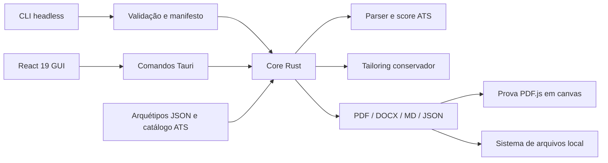

# Arquitetura

## Visão geral

O Reoli Resume Forge separa regras de negócio, adaptação de plataforma e apresentação. A única fonte de verdade para score, tailoring e compilação é o core Rust.

## Módulos

| Camada | Local | Responsabilidade |
| --- | --- | --- |
| Dados | `src/data/` | Arquétipos editáveis e aliases de keywords |
| Domínio web | `src/domain/` | Normalização retrocompatível, layouts, localização estrutural e auditoria documental |
| UI | `src/components/`, `src/hooks/` | Edição modular, prova PDF A4, fallback editável, acessibilidade e atalhos |
| Bridge | `src/services/tauriBridge.ts` | Contrato IPC e fallback visual no navegador de desenvolvimento |
| Core | `src-tauri/src/core/` | Modelos, validação, ATS, tailoring e exportação |
| Adaptadores | `src-tauri/src/commands.rs`, `src-tauri/src/cli.rs`, `src-tauri/src/cli/` | Entrada pela GUI, parsing headless, schemas, manifesto e filesystem |
| Bootstrap | `src-tauri/src/main.rs`, `lib.rs` | Dispatch do modo e inicialização do Tauri |

## Fluxo de dados

1. O perfil nasce de um arquétipo embarcado, de um JSON importado ou de um perfil vazio.
2. React normaliza perfis antigos e mantém um único estado estruturado. Formulários, modais e o modo editável do A4 atualizam esse mesmo estado; esse modo é um apoio rápido e não a prova geométrica final. A biblioteca mantém a escolha de template em rascunho e só altera o perfil após confirmação explícita. A paleta é aplicada separadamente, como um preset seguro que pode ser combinado com qualquer layout. Aparências prontas materializam uma combinação curada de template, paleta, densidade e formatos de seção nessa mesma atualização, por isso todo o conjunto pode ser desfeito em uma única etapa.
3. Após 420 ms sem edição, a GUI envia perfil e Job Description ao core via IPC.
4. O core valida limites, extrai requisitos, cruza evidências e devolve um relatório serializável.
5. Ao adaptar, o core ordena bullets e tecnologias pela relevância, com proveniência e sem criar texto novo.
6. A prova do desktop chama `render_pdf_preview`, que usa `render_with_template` e devolve o PDF em memória. O frontend preserva a última prova válida enquanto aguarda 180 ms de debounce, carrega o documento com PDF.js e renderiza cada página em canvas com escala adequada ao DPR.
7. A exportação chama o mesmo `render_with_template` para gravar o arquivo. Portanto, ordem, visibilidade, seções, template, paleta, tipografia, margens e quebras observados na prova são os do PDF exportado; somente o identificador interno do documento é regenerado.
8. Na automação, `run --manifest` resolve `defaults`, carrega cada JSON independente, aplica overrides do job e da CLI, valida perfil/template/formatos e executa o mesmo tailoring/exportador. Cada resultado mantém ID, score, keywords, domínios e caminhos para consumo por outra IA.

## Limites de segurança

- A aplicação não contém backend, autenticação, telemetria ou sincronização externa.
- A CLI rejeita entradas acima de 1 MiB e lotes/manifestos vazios ou acima de 500 jobs.
- O core limita tamanho do resumo e quantidade de experiências/projetos.
- O caminho de exportação da GUI vem do diálogo nativo; na CLI, o diretório é criado e canonizado antes da gravação. Subpastas do manifesto rejeitam caminhos absolutos e `..`; nomes-base rejeitam caracteres inválidos do Windows.
- O padrão de conflito é `error`; `rename` e `overwrite` exigem escolha explícita. `--dry-run` não cria diretórios nem arquivos.
- Keywords declaradas em `target_keywords` não contam sozinhas como evidência; a comprovação deve existir no conteúdo profissional.
- Tailoring apenas seleciona e reordena bullets existentes.

## Formatos ATS

PDF e DOCX usam texto selecionável, headings convencionais e fontes seguras. `classic`, `tech-minimalist`, `executive-bold`, `academic`, `clean`, `compact` e `executive` preservam leitura linear; `modern-split` oferece uma composição visual em duas colunas e é sinalizado como opção de maior risco para parsers antigos. Quando uma experiência ou projeto atravessa uma quebra de página, o PDF repete uma âncora curta com o nome do registro antes da continuação, evitando bullets e tecnologias sem contexto. URLs usam hyperlinks externos reais e nenhum dado essencial fica em header, footer ou imagem.

O modo editável pode mostrar skills em tabela, mas usa `caption`, `th` e escopo semântico. A prova PDF usa a contagem real de páginas do arquivo compilado para alimentar o assistente local: em uma página compacta ele pode sugerir `balanced`; acima de duas páginas sugere `compact`; se o documento já estiver compacto, pede revisão humana de conteúdo. A auditoria replica limites úteis do gerador do Vault: até duas páginas, resumo de até 110 palavras e bullets de até 35 palavras. A ação altera somente `layout.density`, preserva o texto e integra o histórico de desfazer/refazer. Esses itens são recomendações, não promessa de aprovação.

O palco usa `ResizeObserver` para calcular o zoom de encaixe a partir da largura útil real, descontando os paddings responsivos. A caixa externa recebe as dimensões já escaladas enquanto o documento A4 interno usa `transform`, evitando barras de rolagem criadas pela geometria não escalada. `–` e `+` desativam temporariamente o encaixe; o controle dedicado volta ao modo responsivo sem alterar conteúdo ou paginação.

## Contrato modular 2.0

`ResumeProfile.layout` guarda `section_order`, `hidden_sections`, apresentações de skills/experiências/projetos, densidade e níveis informados pelo usuário. `ResumeProfile.config.template` guarda um dos oito modelos visuais; `config.palette` guarda um dos seis presets cromáticos; `config.typeface` guarda uma das quatro famílias tipográficas. Esses campos integram salvamento, importação, histórico, GUI e CLI. Cada template possui uma aparência curada na mesa de provas; os ajustes independentes ficam em uma região de revelação progressiva para não alongar o fluxo principal. Aparências prontas não criam um formato proprietário adicional: elas preenchem os campos existentes, preservando compatibilidade com a CLI e permitindo customização posterior. O core resolve cores e fontes a partir de IDs conhecidos, em vez de confiar em valores arbitrários importados, para preservar contraste, paginação e portabilidade. Blocos opcionais vivem em `custom_sections`; IDs `custom:<id>` entram na mesma ordem das seções nativas. Perfis 1.x são normalizados no frontend e usam defaults Serde no core Rust.

Os diálogos compartilham `useDialogFocus`: foco inicial previsível, contenção de `Tab`/`Shift+Tab`, fechamento com `Esc` e retorno ao controle de origem. Esse contrato mantém a biblioteca de modelos e os editores focados operáveis sem mouse.

## Executável único

`main.rs` inspeciona o primeiro argumento. Sem argumento ou com `ui`, inicia o Tauri; nos demais casos, executa a CLI sem abrir janela. O bundle do frontend e os cinco arquétipos são incorporados em `reoliresume.exe`. O instalador NSIS por usuário inclui o bootstrapper do WebView2 e registra `$INSTDIR` no `PATH`; o uninstall remove essa entrada. O portátil continua disponível sem sidecars, usando o WebView2 já instalado para a GUI.
