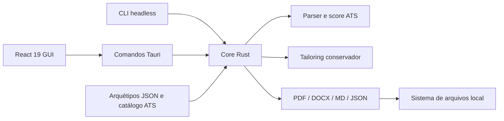

# Arquitetura

## Visão geral

O Reoli Resume Forge separa regras de negócio, adaptação de plataforma e apresentação. A única fonte de verdade para score, tailoring e compilação é o core Rust.

## Módulos

| Camada | Local | Responsabilidade |
| --- | --- | --- |
| Dados | `src/data/` | Arquétipos editáveis e aliases de keywords |
| Domínio web | `src/domain/` | Normalização retrocompatível, layouts, localização estrutural e auditoria documental |
| UI | `src/components/`, `src/hooks/` | Edição modular, preview A4, acessibilidade e atalhos |
| Bridge | `src/services/tauriBridge.ts` | Contrato IPC e fallback visual no navegador de desenvolvimento |
| Core | `src-tauri/src/core/` | Modelos, validação, ATS, tailoring e exportação |
| Adaptadores | `src-tauri/src/commands.rs`, `cli.rs` | Entrada pela GUI ou pelo terminal |
| Bootstrap | `src-tauri/src/main.rs`, `lib.rs` | Dispatch do modo e inicialização do Tauri |

## Fluxo de dados

1. O perfil nasce de um arquétipo embarcado, de um JSON importado ou de um perfil vazio.
2. React normaliza perfis antigos e mantém um único estado estruturado. Formulários, modais e conteúdo editável do A4 atualizam esse mesmo estado.
3. Após 420 ms sem edição, a GUI envia perfil e Job Description ao core via IPC.
4. O core valida limites, extrai requisitos, cruza evidências e devolve um relatório serializável.
5. Ao adaptar, o core ordena bullets e tecnologias pela relevância, com proveniência e sem criar texto novo.
6. O exportador serializa o mesmo perfil, ordem, visibilidade, seções personalizadas e template para o formato escolhido.

## Limites de segurança

- A aplicação não contém backend, autenticação, telemetria ou sincronização externa.
- A CLI rejeita entradas acima de 1 MiB e lotes vazios ou acima de 500 vagas.
- O core limita tamanho do resumo e quantidade de experiências/projetos.
- O caminho de exportação da GUI vem do diálogo nativo; na CLI, o diretório é criado e canonizado antes da gravação.
- Keywords declaradas em `target_keywords` não contam sozinhas como evidência; a comprovação deve existir no conteúdo profissional.
- Tailoring apenas seleciona e reordena bullets existentes.

## Formatos ATS

PDF e DOCX usam texto selecionável, headings convencionais e fontes seguras. `classic`, `tech-minimalist`, `executive-bold`, `academic`, `clean`, `compact` e `executive` preservam leitura linear; `modern-split` oferece uma composição visual em duas colunas e é sinalizado como opção de maior risco para parsers antigos. URLs usam hyperlinks externos reais e nenhum dado essencial fica em header, footer ou imagem.

O preview pode mostrar skills em tabela, mas usa `caption`, `th` e escopo semântico. A auditoria replica limites úteis do gerador do Vault: até duas páginas, resumo de até 110 palavras e bullets de até 35 palavras. Esses itens são recomendações, não promessa de aprovação.

## Contrato modular 2.0

`ResumeProfile.layout` guarda `section_order`, `hidden_sections`, apresentações de skills/experiências/projetos, densidade e níveis informados pelo usuário. Blocos opcionais vivem em `custom_sections`; IDs `custom:<id>` entram na mesma ordem das seções nativas. Perfis 1.x são normalizados no frontend e usam defaults Serde no core Rust.

## Executável único

`main.rs` inspeciona o primeiro argumento. Sem argumento ou com `ui`, inicia o Tauri; nos demais casos, executa a CLI sem abrir janela. O bundle do frontend e os cinco arquétipos são incorporados ao binário. O WebView2 é uma dependência do sistema Windows, não um sidecar distribuído.
